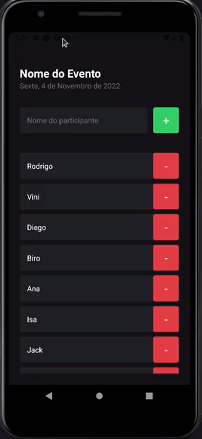

## **💻** Projeto
Projeto desenvolvido durante o primeiro capítulo da trilha de React Native da escola Rockteseat onde foi desenvolvido uma aplicação mobile que consiste basicamente em um  sistema de lista de presença, onde é possível adicionar e remover participantes, tendo assim aprendido os fundamentos dessa tecnologia.

<p align="center">
  
</p>

## 🚀 Tecnologias utilizadas

- [Expo](https://expo.dev/)
- [Typescript](https://www.typescriptlang.org/)
- [ReactJS](https://pt-br.reactjs.org/)

## **🚀** Como Executar

Antes de baixar o projeto você vai precisar ter instalado na sua máquina as seguintes ferramentas:

- [Git](https://git-scm.com/)
- [NodeJS](https://nodejs.org/en/)
- [NPM](https://www.npmjs.com/)
- [Expo (para emular na plataforma)](https://expo.dev/)

Segue os comandos para baixar e executar o projeto na sua máquina:

```bash
## Clone o projeto em sua máquina
git clone https://github.com/srsouzaj/imhere.git

# Acessar o projeto no terminal
$ cd imhere

# Instalar as dependências
$ npm install

# Executar o servidor em modo de desenvolvimento
$ npm run start

# Acessar o expo no emulador desejado
```